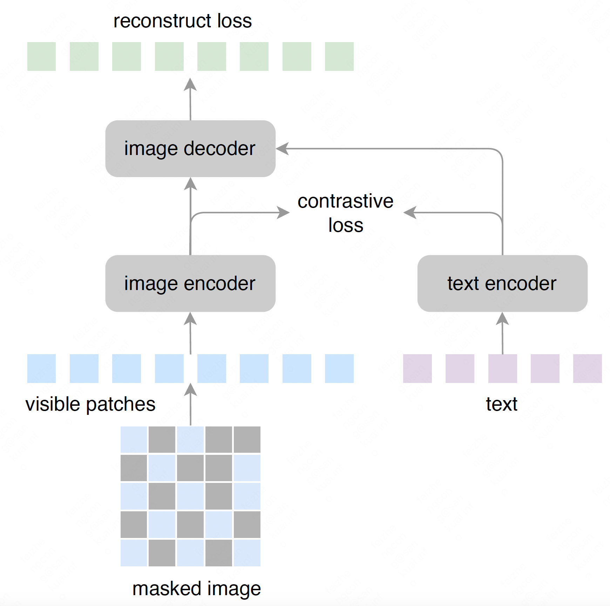

# Text-Guided Masked Autoencoders for Language-Image Pre-training

## 1. Framework 

Overall, we first mask the image, then feed into the image encoder and text encoder to get image and texr features. Next, the text features is used to guid the image mask reconstruction. Finally, we combine the clip loss and reconstruction loss to optimize the model. 

     
      
     <em>
     Overview of the proposed clip-mae framework.
    </em>

## Results

We train on the Conceptual Captions dataset and report the performance about retrieval R1@10 and ImageNet zero-shot accuracy compared without reconstruction loss. 

| Metric | CLIP-MAE | CLIP-MAE + reconstruct |
|------|------|-----|
| R1@10 | 83.4| 85.5|
| ACC-1 |12.5 | 13.3|

## 2. Training

Run `python train.py` with the corresponding arguments. 
To reproduce the results reported in the table, download the checkpoint model file and put it to CKPT file.

## Acknowledgment
This repository is based on [openclip](https://github.com/mlfoundations/open_clip) and [mae](https://github.com/facebookresearch/mae).
